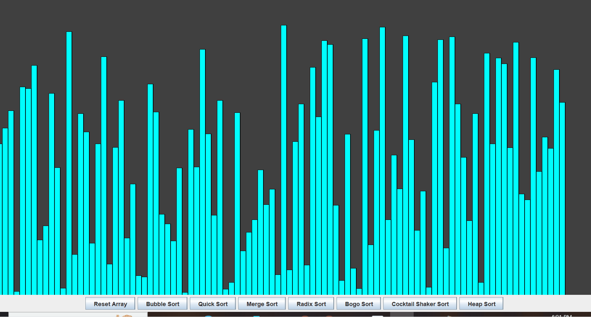

# Java Sorting Algorithm Visualizer




A simple desktop application built with Java Swing that visualizes the inner workings of various sorting algorithms. This project makes complex algorithms easier to understand by showing how data is compared and swapped in real-time.

---

## Features

- **Dynamic Visualization:** Watch sorting algorithms operate on an array of bars in real-time.
- **Multiple Algorithms:** A wide range of sorting algorithms are implemented:
  - [x] Bubble Sort
  - [x] Quick Sort
  - [x] Merge Sort
  - [x] Radix Sort
  - [x] Heap Sort
  - *and more...*
- **Simple Controls:** Easily reset the array or select a new algorithm to run.

---

## Technologies Used

- **Java**: Core application language.
- **Java Swing**: For the graphical user interface (GUI).

---

## How to Run Locally

1.  **Clone the repository:**
    ```sh
    git clone [https://github.com/YOUR-USERNAME/Java-Sorting-Visualizer.git](https://github.com/YOUR-USERNAME/Java-Sorting-Visualizer.git)
    ```
2.  **Navigate to the project directory:**
    ```sh
    cd Java-Sorting-Visualizer
    ```
3.  **Compile the Java files:**
    ```sh
    javac *.java
    ```
4.  **Run the application:**
    ```sh
    java AlgorithmVisualizer
    ```
